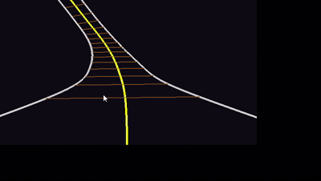

# RollerCoasterSimulation

https://stormy-airbus-32f.notion.site/Assignment-3-Roller-Coaster-Simulation-19a690c0094380bc8807f64d66022f63


- Closed Catmull-Rom spline
- Arc Length Reparameterization
- Tangent / Normal / Binormal 기반 Moving Coordinate Frame
- 중력 기반 속도 변화 시뮬레이션

<br>
<br>


내가 아는 좌표축과 Roll - Pitch - Yaw<br>


출처: https://kr.mathworks.com/help/sl3d/coordinate-systems-in-simulink-3d-animation.html#mw_8970b1aa-6c7b-4b9e-9120-6947377713ef

<br>
<br>

OpenGL 의 오른손 좌표계


출처: https://learnopengl.com/Getting-started/Camer


## 실행 환경

* OS: Windows
* Language: C++
* IDE: Visual Studio 2026
* pkgfile: freeglut,glew
  * freeglut :  https://www.transmissionzero.co.uk/software/freeglut-devel/
  * glew :  http://glew.sourceforge.net/


## 문서 구조
```
RollerCoasterSimulation/
ㄴ-- RollerCoasterSimulation/
|    ㄴ-- main.cpp
|    ㄴ-- RollerCoasterSimulation.h // spline초기화 ,table 생성,속도 update, rendering
|    ㄴ-- RollerCoasterSimulation.cpp
|    ㄴ-- CatmullRomSpline.h //control point 저장, spline point 계산, derivative 계산
|    ㄴ-- CatmullRomSpline.cpp
|    ㄴ-- ArcLengthTable.h //spline을 일정 개수로 샘프링하 실제 길이 기반 table을 생성
|    ㄴ-- ArcLengthTable.cpp
|    ㄴ-- ArcSample.h //sample 정보를 저장
|    ㄴ-- ArcSample.cpp
|    ㄴ-- Vec3.h //3D vector 연
|    ㄴ-- Vec3.cpp
ㄴ-- RollerCoasterSimulation_record.gif
ㄴ-- RollerCoasterSimulation.slnx
```


## 구현 개념


1. Track Sampling
   Spline parameter 범위 전체를 일정 개수로 나누어 sample을 생성.<br>
   시간 흐름-> 이동거리 증가 -> 누적된 거리에 맞는 파람 도출<br>
   각 sample마다 정보를 저장
     - 누적 길이
     - spline parameter
     - 위치
     - tangent == 진향방향
     - normal == 롤러코스터 앉았을떄 정수리 방향
     - binormal == 레일 평면 (좌우로 펼쳐지는 방향)

<br>
<br>

2. Arc-Length Lookup
   $$P(t) = 0.5 \times \left[ 2.0P_1 + (-P_0 + P_2)t + (2.0P_0 - 5.0P_1 + 4.0P_2 - P_3)t^2 + (-P_0 + 3.0P_1 - 3.0P_2 + P_3)t^3 \right]$$

$$P'(t) = 0.5 \times \left[ (-P_0 + P_2) + 2.0(2.0P_0 - 5.0P_1 + 4.0P_2 - P_3)t + 3.0(-P_0 + 3.0P_1 - 3.0P_2 + P_3)t^2 \right]$$

   현재 이동 거리에 해당하는 parameter를 찾기 위해 binary search를 이용하여 테이블탐색.<br>
   찾은 두 sample 사이에서 선형보간을 통해 더 근사한 parameter를 계산.

   ```
   P(t) = 0.5 * {2.0 * p1 + (-p0 + p2) * t + (2.0 * p0 - 5.0 * p1 + 4.0 * p2 - p3) * t^2 + (-p0 + 3.0 * p1 - 3.0 * p2 + p3) * t^3}
   P'(t) = 0.5 * {(-p0 + p2) + 2.0 * (2.0 * p0 - 5.0 * p1 + 4.0 * p2 - p3) * t + 3.0 * (-p0 + 3.0 * p1 - 3.0 * p2 + p3) * t^2}
   ```

<br>
<br>


3. Frame Construction
  처음 sample에서는 world up vector를 기준으로 normal 생성.<br>
  단, tangent가 world up과 거의 평행한 경우 normal 계산이 불안정해질 수 있으므로 기준 벡터를 x축으로 변경.<br>
  이후 sample에서 frame이 뒤집히는 것을바지하기 위해 이전 frame을 현재 tangent 방향에 맞추어 회전.

<br>
<br>

4. Camera
   카메라 위치는 레일 위 현제 position에서 normal 방향으로 약간 띄운 위치로 세팅.<br>
   카메라가 바라보는 방향은 tangent (== 진행 방향)


<br>
<br>

5. Physics
   에너지 보존식 : $$\frac{1}{2}mv^2 + mgh = mgh_{max}$$ <br>
     -> 따라서 속도 v = sqrt(2 * g * (h_max - h)) <br>
   위치 업데이트: s = s + v * dt;





## 주요 함수 설명
AddControlPoint : 롤러코스터 트랙을 만들 control point를 추가 <br>     
GetPoint : 현재 롤러코스터 위치 계산. <br>
GetDerivative :현재 위치에서 곡선이 향하는 방향 + 변화량 <br>
GetTangent :현재 위치에서 앞으로 가는 방향 <br>
Rebuild : control point로 spline을 만든 뒤, arc length table을 다시 계산 <br>
Sampling() : s(u) ≈ Σ |P(ui) - P(ui-1)|. <br>
              u를 조금씩 증가-> P(u) 계산->이전 위치와 현재 위치 거리 계산-> 누적 거리 D 저장<br>
FrameAtArcLength :특정 거리에서 위치와 방향 정보를 반환<br>

